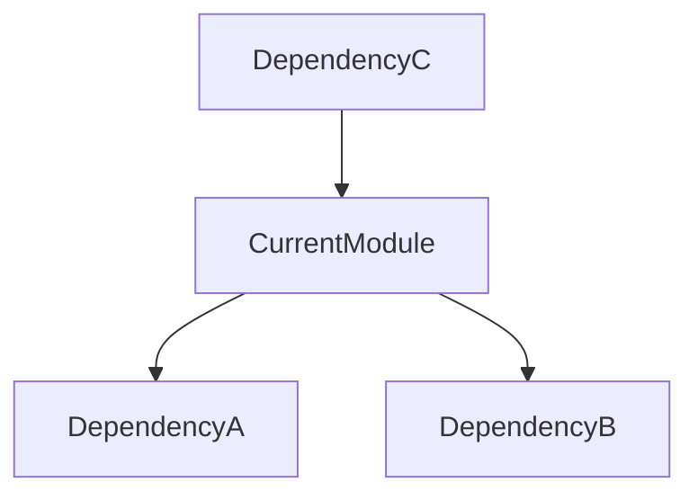

# Mapping Patterns

Use these templates to structure the analysis of codebase chunks.

## 1. Logic Anchors
*Identify the core immutable truths of the module.*

| Anchor ID | Description | Stability |
| :--- | :--- | :--- |
| `ANCHOR-[File]-[01]` | [Description of critical logic/invariant] | High/Med/Low |

**Example:**
> `ANCHOR-Auth-01`: The `validate_token` function is the single point of entry for all API requests. Stability: High.

## 2. Dependency Graphs
*Map how this module relates to others.*

**Format:**
- **Incoming**: list modules that call this chunk.
- **Outgoing**: list modules this chunk calls.
- **External**: list 3rd party libraries used.

## 3. Breaking Points
*Identify fragile areas that may break during evolution.*

| Point ID | Location | Risk | Mitigation |
| :--- | :--- | :--- | :--- |
| `BREAK-[File]-[01]` | [Line # or Function] | [Why it might break] | [How to prevent] |

**Example:**
> `BREAK-Db-01`: Hardcoded connection string in `db_connect`. Risk: Deployment failure. Mitigation: Move to env vars.
